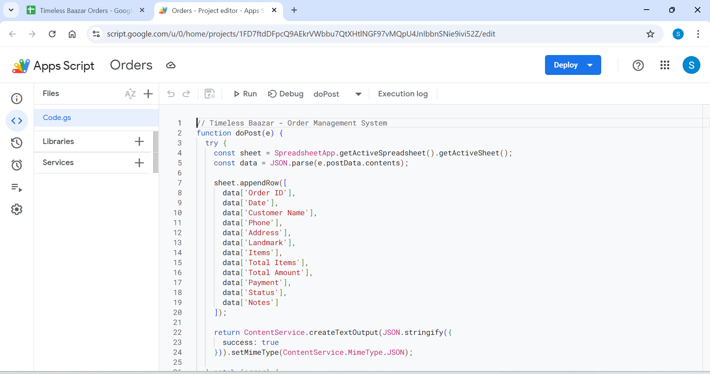

# Google Apps Script Update - Order Tracking + Email Notifications

> ## ⚠️ Superseded — do not deploy the script below
>
> **Use [`docs/GOOGLE_SHEET_SYNC.md`](docs/GOOGLE_SHEET_SYNC.md) instead.**
>
> The script on this page `appendRow`s on every POST. The backend now re-posts
> an order whenever the shop completes or cancels it, so this version would add
> a **second row for the same order** instead of updating the first one. The
> replacement upserts on `Order ID`.
>
> Two more things here are out of date: the twelve hardcoded column positions
> (the backend sends eighteen fields now, and the new script maps by header
> name), and `doGet` with its six-status `normalizeStatus` map — the app reads
> orders from `/api/orders` and has three statuses: `placed`, `completed`,
> `cancelled`.
>
> Kept only as the record of what was deployed before 2026-09-03.

## 📋 Overview
This update adds:
1. **📧 Instant Email Notifications** - Get beautiful email alerts when orders are placed (100/day FREE)
2. **📊 Real-time Order Tracking** - Customers can track order status on website
3. **💾 Auto-save to Google Sheets** - All orders stored automatically

## 🔧 Setup Instructions

### Step 1: Open Your Google Apps Script

1. Go to your Google Sheet: https://docs.google.com/spreadsheets/d/1opXq7Nee7pA6U8W5DsOq_FiSDMSqRl0upphIarauH8I
2. Click **Extensions** → **Apps Script**
3. Replace your existing script with the code below

### Step 2: Configure Your Email

**IMPORTANT:** In the code below, find this line and replace with YOUR email:

```javascript
const NOTIFICATION_EMAIL = "your-email@gmail.com"; // 👈 CHANGE THIS!
```

**Example:**
```javascript
const NOTIFICATION_EMAIL = "yourname@gmail.com";
```

### Step 3: Copy This Complete Code

Select ALL the code below and paste it into Google Apps Script (replacing everything):

```javascript
// Timeless Baazar - Order Management System
// Handles both POST (new orders) and GET (order tracking) requests

// ⚡ CONFIGURE YOUR EMAIL HERE ⚡
const NOTIFICATION_EMAIL = "your-email@gmail.com"; // 👈 CHANGE THIS TO YOUR EMAIL!

function doPost(e) {
  try {
    const sheet = SpreadsheetApp.getActiveSpreadsheet().getActiveSheet();
    const data = JSON.parse(e.postData.contents);
    
    // Add new order row
    sheet.appendRow([
      data['Order ID'],
      data['Date'],
      data['Customer Name'],
      data['Phone'],
      data['Address'],
      data['Landmark'],
      data['Items'],
      data['Total Items'],
      data['Total Amount'],
      data['Payment'],
      data['Status'],
      data['Notes']
    ]);
    
    // 🔔 SEND INSTANT EMAIL NOTIFICATION
    sendOrderNotification(data);
    
    return ContentService.createTextOutput(JSON.stringify({
      success: true,
      message: 'Order added successfully'
    })).setMimeType(ContentService.MimeType.JSON);
    
  } catch (error) {
    return ContentService.createTextOutput(JSON.stringify({
      success: false,
      error: error.toString()
    })).setMimeType(ContentService.MimeType.JSON);
  }
}

// 📧 Send email notification for new orders
function sendOrderNotification(data) {
  try {
    const subject = `🛍️ New Order: ${data['Order ID']} - ₹${data['Total Amount']}`;
    
    const htmlBody = `
      <div style="font-family: Arial, sans-serif; max-width: 600px; margin: 0 auto; padding: 20px; background-color: #f9fafb;">
        <div style="background-color: white; border-radius: 8px; padding: 30px; box-shadow: 0 2px 4px rgba(0,0,0,0.1);">
          <h2 style="color: #10b981; margin-top: 0;">🎉 New Order Received!</h2>
          
          <div style="background-color: #f3f4f6; padding: 15px; border-radius: 6px; margin: 20px 0;">
            <h3 style="margin: 0 0 10px 0; color: #374151;">Order Details</h3>
            <p style="margin: 5px 0;"><strong>Order ID:</strong> ${data['Order ID']}</p>
            <p style="margin: 5px 0;"><strong>Date:</strong> ${data['Date']}</p>
            <p style="margin: 5px 0;"><strong>Total Amount:</strong> <span style="color: #10b981; font-size: 18px; font-weight: bold;">₹${data['Total Amount']}</span></p>
            <p style="margin: 5px 0;"><strong>Payment:</strong> ${data['Payment']}</p>
          </div>
          
          <div style="background-color: #eff6ff; padding: 15px; border-radius: 6px; margin: 20px 0;">
            <h3 style="margin: 0 0 10px 0; color: #374151;">Customer Information</h3>
            <p style="margin: 5px 0;"><strong>Name:</strong> ${data['Customer Name']}</p>
            <p style="margin: 5px 0;"><strong>Phone:</strong> <a href="tel:${data['Phone']}" style="color: #2563eb;">${data['Phone']}</a></p>
            <p style="margin: 5px 0;"><strong>Address:</strong> ${data['Address']}</p>
            ${data['Landmark'] !== '-' ? `<p style="margin: 5px 0;"><strong>Landmark:</strong> ${data['Landmark']}</p>` : ''}
          </div>
          
          <div style="background-color: #fef3c7; padding: 15px; border-radius: 6px; margin: 20px 0;">
            <h3 style="margin: 0 0 10px 0; color: #374151;">Items Ordered (${data['Total Items']})</h3>
            <p style="margin: 5px 0; white-space: pre-wrap;">${data['Items']}</p>
          </div>
          
          ${data['Notes'] !== '-' ? `
          <div style="background-color: #fce7f3; padding: 15px; border-radius: 6px; margin: 20px 0;">
            <h3 style="margin: 0 0 10px 0; color: #374151;">Customer Notes</h3>
            <p style="margin: 5px 0;">${data['Notes']}</p>
          </div>
          ` : ''}
          
          <div style="margin-top: 30px; padding-top: 20px; border-top: 2px solid #e5e7eb;">
            <p style="margin: 5px 0;"><strong>📊 Next Steps:</strong></p>
            <ol style="margin: 10px 0; padding-left: 20px;">
              <li>Open your <a href="https://docs.google.com/spreadsheets/d/1opXq7Nee7pA6U8W5DsOq_FiSDMSqRl0upphIarauH8I" style="color: #2563eb;">Google Sheet</a></li>
              <li>Update order status (Confirmed/Preparing/Out for Delivery/Delivered)</li>
              <li>Contact customer at <a href="tel:${data['Phone']}" style="color: #2563eb;">${data['Phone']}</a></li>
            </ol>
          </div>
          
          <p style="text-align: center; color: #6b7280; font-size: 12px; margin-top: 30px;">
            Timeless Baazar - Automated Order Notification System<br>
            📧 Limit: 100 emails/day | <a href="https://docs.google.com/spreadsheets/d/1opXq7Nee7pA6U8W5DsOq_FiSDMSqRl0upphIarauH8I" style="color: #2563eb;">View All Orders</a>
          </p>
        </div>
      </div>
    `;
    
    // Send email
    MailApp.sendEmail({
      to: NOTIFICATION_EMAIL,
      subject: subject,
      htmlBody: htmlBody
    });
    
    Logger.log("✅ Email notification sent to: " + NOTIFICATION_EMAIL);
    
  } catch (error) {
    Logger.log("❌ Failed to send email notification: " + error.toString());
  }
}

function doGet(e) {
  try {
    const action = e.parameter.action;
    
    if (action === 'getOrder') {
      const orderId = e.parameter.orderId;
      const sheet = SpreadsheetApp.getActiveSpreadsheet().getActiveSheet();
      const data = sheet.getDataRange().getValues();
      
      // Find order by ID (assuming Order ID is in column A, index 0)
      for (let i = 1; i < data.length; i++) { // Start from 1 to skip header
        if (data[i][0] === orderId) {
          // Found the order
          const orderData = {
            found: true,
            order: {
              orderId: data[i][0],
              orderDate: data[i][1],
              customer: {
                name: data[i][2],
                phone: data[i][3],
                address: data[i][4].split(',')[0], // Split address
                city: extractCity(data[i][4]),
                pincode: extractPincode(data[i][4]),
                landmark: data[i][5]
              },
              items: parseItems(data[i][6]), // Parse items string
              total: data[i][8],
              paymentMethod: data[i][9],
              status: normalizeStatus(data[i][10]), // Normalize status
              notes: data[i][11]
            }
          };
          
          return ContentService.createTextOutput(JSON.stringify(orderData))
            .setMimeType(ContentService.MimeType.JSON);
        }
      }
      
      // Order not found
      return ContentService.createTextOutput(JSON.stringify({
        found: false,
        message: 'Order not found'
      })).setMimeType(ContentService.MimeType.JSON);
    }
    
    return ContentService.createTextOutput(JSON.stringify({
      error: 'Invalid action'
    })).setMimeType(ContentService.MimeType.JSON);
    
  } catch (error) {
    return ContentService.createTextOutput(JSON.stringify({
      error: error.toString()
    })).setMimeType(ContentService.MimeType.JSON);
  }
}

// Helper function to extract city from address
function extractCity(address) {
  const parts = address.split(',');
  if (parts.length >= 2) {
    const cityPart = parts[parts.length - 2].trim();
    return cityPart;
  }
  return '';
}

// Helper function to extract pincode from address
function extractPincode(address) {
  const match = address.match(/\d{6}/);
  return match ? match[0] : '';
}

// Helper function to parse items string into array
function parseItems(itemsString) {
  if (!itemsString) return [];
  
  const items = [];
  const itemParts = itemsString.split(',');
  
  itemParts.forEach(part => {
    const match = part.trim().match(/^(.+?)\s*\((.+?)\)\s*x(\d+)$/);
    if (match) {
      items.push({
        name: match[1].trim(),
        nameHindi: '',
        size: match[2].trim(),
        quantity: parseInt(match[3]),
        price: 0 // Price not stored separately, calculate from total if needed
      });
    }
  });
  
  return items;
}

// Helper function to normalize status from Google Sheets
function normalizeStatus(status) {
  if (!status) return 'pending';
  
  const statusLower = status.toLowerCase().trim();
  const statusMap = {
    'pending': 'pending',
    'confirmed': 'confirmed',
    'preparing': 'preparing',
    'out for delivery': 'out_for_delivery',
    'delivered': 'delivered',
    'cancelled': 'cancelled'
  };
  
  return statusMap[statusLower] || 'pending';
}
```

### Step 4: Deploy the Script

1. Click **💾 Save** icon (or Ctrl+S)
2. Click **Deploy** → **Manage deployments**
3. Click **✏️ Edit** (pencil icon) on your existing deployment
4. Change **Version** to "New version"
5. Click **Deploy**
6. **IMPORTANT: Grant Email Permissions**
   - Click **Authorize access**
   - Select your Google account
   - You'll see a warning "Google hasn't verified this app"
   - Click **Advanced** → **Go to [Your Project Name] (unsafe)**
   - Click **Allow** ✅
   - This allows the script to send emails on your behalf
7. Click **Done**

**Note:** Your existing Web App URL remains the same, no need to update anything in your website!

### Step 5: Test Email Notifications

1. **Place a test order** on your website
2. **Check your email** (the one you configured)
3. You should receive a beautiful email within **5-10 seconds**! 📧

**If you don't receive the email:**
- ✅ Check **Spam/Junk folder**
- ✅ Verify email address in script is correct
- ✅ Make sure you granted email permissions
- ✅ Check **Google Apps Script → Executions** for errors

### Step 6: Update Your Sheet Headers (If Not Already Done)

Make sure your Google Sheet has these column headers in Row 1:

| A | B | C | D | E | F | G | H | I | J | K | L |
|---|---|---|---|---|---|---|---|---|---|---|---|
| Order ID | Date | Customer Name | Phone | Address | Landmark | Items | Total Items | Total Amount | Payment | Status | Notes |

## 📊 How to Update Order Status

1. Open your Google Sheet
2. Find the order by Order ID (Column A)
3. Update the **Status** column (Column K) with one of these values:
   - `Pending` - Order received
   - `Confirmed` - Order confirmed
   - `Preparing` - Preparing order
   - `Out for Delivery` - Order dispatched
   - `Delivered` - Order delivered
   - `Cancelled` - Order cancelled

4. Customer visits the Track Order page
5. Enters their Order ID
6. Clicks "Track Order" or "Refresh" button
7. Sees the updated status in real-time!

## ✅ Features Now Available

1. **Real-time Status Updates** - Status changes in Google Sheets reflect on website
2. **Order Tracking Page** - Customers can track their orders
3. **Refresh Button** - Manual refresh to get latest status
4. **Fallback** - Uses localStorage if Google Sheets is unavailable
5. **Zero Cost** - Completely free using Google Apps Script

## 🎨 Status Options

The website displays these statuses beautifully:

- 🕐 **Pending** - Yellow/Gold color
- ✅ **Confirmed** - Blue color
- 📦 **Preparing** - Orange color
- 🚚 **Out for Delivery** - Purple color
- 🎉 **Delivered** - Green color
- ❌ **Cancelled** - Red color

## 🔗 Customer Journey

1. Customer places order → Gets Order ID
2. Customer copies Order ID
3. Customer goes to "Track Order" page
4. Enters Order ID → Clicks "Track Order"
5. Sees current status
6. Can click "Refresh" anytime to get updated status
7. Status automatically syncs from Google Sheets!

## 🎯 Testing

1. Place a test order
2. Note the Order ID
3. Go to Track Order page: `http://localhost:3000/track-order`
4. Enter Order ID and click "Track Order"
5. See order details
6. In Google Sheets, change status to "Confirmed"
7. Click "Refresh" on website
8. Status updates to "Confirmed" ✅

---

## 📧 Email Notification Features

**What you'll receive in each email:**
- 🆔 Order ID
- 💰 Total Amount (highlighted in green)
- 👤 Customer Name, Phone (clickable), Address
- 📦 Complete Items List with quantities
- 📝 Customer Notes (if any)
- 🔗 Direct link to your Google Sheet
- 📞 Clickable phone number to call customer

**Email Limits:**
- ✅ **100 emails per day** (FREE)
- ✅ Resets at midnight Pacific Time
- ✅ More than enough for a grocery store!

**Sample Email Subject:**
```
🛍️ New Order: TB1738275423999123 - ₹2,450
```

---

## 🎯 Quick Summary - What You Need to Do

1. ✅ Open your [Google Sheet](https://docs.google.com/spreadsheets/d/1opXq7Nee7pA6U8W5DsOq_FiSDMSqRl0upphIarauH8I)
2. ✅ Go to **Extensions → Apps Script**
3. ✅ Copy the complete code from **Step 3** above
4. ✅ **CHANGE** the email address: `const NOTIFICATION_EMAIL = "your-email@gmail.com";`
5. ✅ Save (Ctrl+S)
6. ✅ Deploy → Manage deployments → Edit → New version → Deploy
7. ✅ **Grant email permissions** when asked
8. ✅ Place a test order
9. ✅ Check your email inbox! 🎉

**Total Time:** 5 minutes  
**Cost:** FREE  
**Daily Limit:** 100 emails  

---

**All features implemented with ZERO COST! 🎉**
